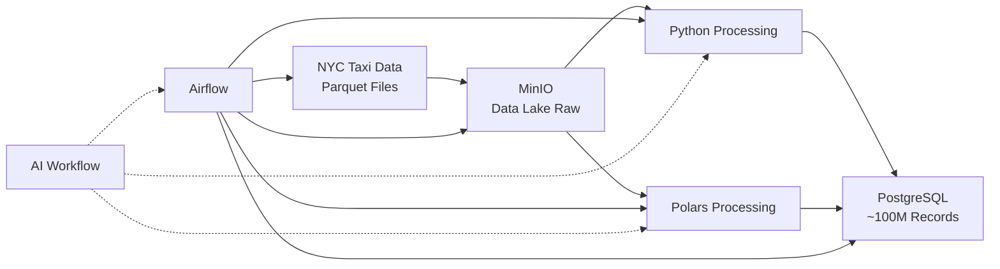
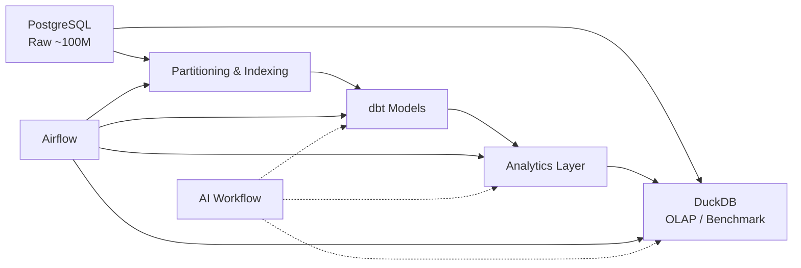
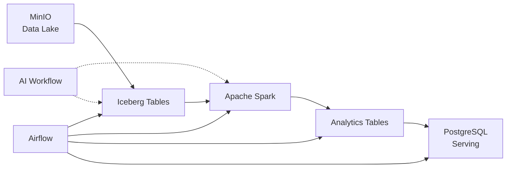

# Las 3 etapas del proyecto (y por qué en este orden)

No empezamos con Spark. No empezamos con Kafka.  
Empezamos donde se construye el fundamento.

### Etapa 1 — Ingesta y procesamiento batch

**Qué construyes:**  
Un pipeline batch que ingiere datos desde archivos Parquet públicos, los almacena en MinIO (Data Lake raw), los procesa de dos formas (Python puro vs Polars) y los carga en PostgreSQL hasta llegar a ~100M registros.

**Por qué este orden:**  
Porque si no entiendes el batch local, el procesamiento distribuido será magia negra para ti. Primero entiendes la latencia, la memoria, el paralelismo en un solo nodo. Luego escalas.

**Dónde está la IA:**  
No dentro del pipeline. La IA es tu asistente de desarrollo. Te ayuda a escribir el código, debuggear, optimizar. Pero la ejecución es 100% determinista.

---

### Etapa 2 — Optimización, modelado y analítica

**Qué construyes:**  
Sobre los datos crudos, aplicas particionamiento e índices. Construyes modelos dbt incrementales (staging, marts). Creas una capa analítica lista para consumo. Además, usas DuckDB para hacer consultas OLAP validadas y comparar rendimiento con PostgreSQL.

**Por qué este orden:**  
Porque tener datos crudos no sirve de nada. Los datos se vuelven útiles cuando los modelas para preguntas concretas. Y aquí aprendes a hacerlo de forma reproducible y declarativa (dbt).

**Dónde está la IA:**  
Sigue siendo asistente. Ahora también para generar consultas SQL complejas, optimizar modelos dbt y ayudarte a validar resultados contra DuckDB.

---

### Etapa 3 — Lakehouse distribuido y escalabilidad

**Qué construyes:**  
Abandonas PostgreSQL como centro del sistema. Todo va a MinIO. Sobre él, creas tablas Iceberg (versionadas, ACID en el lake). Procesas con Spark de forma distribuida. PostgreSQL queda solo como capa opcional de serving o validación.

**Por qué este orden:**  
Porque cuando tus datos crecen (cientos de millones de filas, terabytes), una base de datos single-node se queda corta. El lakehouse te da escalabilidad sin perder las bondades de un sistema transaccional analítico.

**Dónde está la IA:**  
Asistente en generación de jobs Spark, optimización de transformaciones distribuidas y debugging de pipelines en clúster.

---

## Las tres capas transversales (existen en todas las etapas)

| Capa | Herramienta | Qué hace | Dónde aplica |
| :--- | :--- | :--- | :--- |
| **Orquestación** | Apache Airflow | Coordina tareas, reintentos, dependencias | Etapas 1, 2, 3 |
| **IA como workflow** | Multi-LLM (cualquier modelo) | Asiste en generación, debug, documentación | Etapas 1, 2, 3 |
| **Almacenamiento base** | MinIO (S3-compatible) | Data Lake para raw, procesado y analítico | Etapas 1, 3 |

Airflow no es un "módulo aparte". Es el pegamento que hace que todo corra sin que tú tengas que ejecutar comandos manualmente.

---

## El resultado final (lo que vas a poder hacer)

Cuando termines este proyecto, alguien te preguntará:

> *"¿Por qué diseñaste el pipeline así?"*

Y vas a poder responder. No con "porque el tutorial lo hacía así". Sino con:

> *"Porque la etapa 1 necesitaba claridad en el procesamiento batch. La etapa 2 demostró que DuckDB es más rápido en ciertas agregaciones que PostgreSQL particionado. La etapa 3 migró a Iceberg+Spark porque el volumen proyectado superaba la capacidad de cómputo single-node. Además, usé IA para generar el código inicial, pero cada paso está validado con datos reales y documentado."*

Eso es **pensar como un Ingeniero de Datos** en 2026.

---

## El diferenciador (por qué esto no es otro curso)

Otros te enseñan:

- "Cómo usar Spark"
- "Cómo escribir dbt"
- "Cómo configurar Airflow"

Nosotros te enseñamos:

> **Cómo trabajar como ingeniero en la era de la IA.**  
> Multi-LLM, pipelines que alimentan IA, infraestructura diseñada para agentes, no solo para humanos.

Esa diferencia, en el mercado de 2026, vale entre el doble y el triple en salario. Y, sobre todo, te permite construir cosas que otros no saben ni por dónde empezar.

---

## Cierre 

Este proyecto no es fácil.

Vas a tener momentos en la etapa 2 donde dbt no te compile porque un tipo de dato no coincide.  
Vas a tener momentos en la etapa 3 donde Spark te tire un error de memoria que no entiendes.

Esos momentos de incomodidad son los que más te enseñan.

No te voy a vender que será rápido. Te garantizo que si lo terminas, no vas a "saber de herramientas". Vas a **pensar como un ingeniero de datos de 2026**.

Y eso, en este mercado, es oro.

> 🧘 *El cambio no es aprender IA.  
> El cambio es aprender a diseñar sistemas donde la IA ya es parte del flujo.*

Arrancamos.
